
<!-- PROJECT LOGO -->

  
  <h3 align="center">ỨNG DỤNG QUẢN LÝ DANH SÁCH CÁC ĐỀ TÀI MÔN HỌC CỦA KHOA</h3>

  

    Đây là 1 ứng dụng web quản lý danh sách đề tài các môn học của khoa, sử dụng React và Supabase để xây dựng !
     
    <a href="https://course-project-management.vercel.app"><strong>Khám phá ứng dụng này »</strong></a>
     
     
    <a href="https://drive.google.com/drive/folders/11HVAlp9b0KX8AYeZvBonFd9Rz5hEU-2L">Xem demo</a>
    ·
    <a href="https://github.com/Sunny020303/course-project-management">Báo lỗi</a>
    ·
    <a href="https://github.com/Sunny020303/course-project-management">Yêu cầu tính năng</a>
  

<!-- TABLE OF CONTENTS -->

  
Nội dung

  <ol>
    <li>
      <a href="#about-the-project">Về ứng dụng này</a>
      <ul>
        <li><a href="#built-with">Xây dựng với</a></li>
      </ul>
    </li>
    <li>
      <a href="#getting-started">Bắt đầu sử dụng</a>
      <ul>
        <li><a href="#installation">Cài đặt</a></li>
        <li><a href="#demo-account">Tài khoản demo</a></li>
      </ul>
    </li>
    <li><a href="#usage">Hướng dẫn sử dụng</a></li>
    <li><a href="#contact">Liên hệ</a></li>
    <li><a href="#acknowledgments">Nguồn tham khảo</a></li>
  </ol>

<!-- ABOUT THE PROJECT -->

## Về ứng dụng này

Ứng dụng được thực hiện với mục tiêu chính là tạo ra một nền tảng trực tuyến hiện đại, tiện lợi, và hiệu quả để hỗ trợ toàn diện cho quá trình quản lý các loại đề tài môn học, đồ án, dự án, sản phẩm, cũng như khóa luận tốt nghiệp và các hoạt động nghiên cứu khoa học trong khoa. Hệ thống hướng đến việc giải quyết các bất cập trong phương pháp quản lý truyền thống, đồng thời nâng cao chất lượng và hiệu quả của công tác đào tạo và nghiên cứu.

Dưới đây là mô tả chi tiết về các tính năng chính của ứng dụng:
1. Tìm kiếm đăng ký đề tài (Sinh viên)
    * Tìm kiếm đề tài:
      * Sinh viên có thể tìm kiếm đề tài bằng tên.
      * Chỉ hiển thị các đề tài đã được thực hiện của sinh viên đó hoặc các đề tài của lớp mà sinh viên tham gia.
    * Đăng ký đề tài:
      * Sinh viên đăng ký đề tài phù hợp với bản thân thông qua danh sách đề tài.
      * Có thể mời các sinh viên khác cùng tham gia.
2. Nộp kết quả đề tài và xem kết quả, nhận xét (Sinh viên)
    * Nộp kết quả của đề tài đã đăng ký:
      * Sinh viên nộp kết quả của đề tài mà mình đăng ký
      * Kết quả bao gồm báo cáo đề tài, source code (nếu có hoặc link Git) và các tài liệu liên quan .
    * Xem kết quả và nhận xét:
      * Sinh viên có thể xem kết quả đánh giá của đề tài sau khi đề tài đã được đánh giá bởi giảng viên. tiết về đơn hàng của mình.
3. Quản lý danh sách đề tài (Giảng viên)
    * Giảng viên có thể xem thông tin các đề tài đã có.
    * Thêm đề tài mới cho một môn học.
    * Xóa, sửa các đề tài mà giảng viên đó quản lý.
4. Đánh giá kết quả và hủy hết quả (Giảng viên)
    * Đánh giá kết quả đề tài:
      * Giảng viên xem kết quả của đề tài (báo cáo, source code, các tài liệu liên quan) và đánh giá kết quả của đề tài
    * Hủy hết quả đánh giá:
      * Giảng viên có thể hủy hết quả của một đề tài môn học nếu phát hiện đề tài đó vi phạm nội qui hoặc không phù hợp với xã hội.
5. Duyệt đề tài đồ án/ khóa luận (Quản lý khoa/Admin)
    * Quản lý khoa duyệt các đề tài trong danh sách đề tài được giảng viên gửi lên đối với một số môn học (Đồ án 1, 2, khóa luận tốt nghiệp,...).
6. Quản lý hệ thống và phân quyền (Quản lý khoa/Admin)
    * Quản lý khoa quản lý danh sách đề tài có trên hệ thống, kết quả đề tài.
    * Quản lý các môn học của khoa.
    * Quản lý tài khoản trong hệ thống, phân quyền cho các tài khoản trong hệ thống.

(<a href="#readme-top">back to top</a>)

### Xây dựng với

### Frameworks và thư viện

<table>
  <tr>
    <td valign="middle" height="130"></td>
    <td valign="middle"></td>
    <td valign="middle"></td>
    <td valign="middle"></td>
  </tr>
</table>

<i>Những công nghệ sử dụng</i>

(<a href="#readme-top">back to top</a>)

<!-- GETTING STARTED -->

## Bắt đầu sử dụng
Truy cập bản [live demo trên Vercel](https://course-project-management.vercel.app) để trải nghiệm ứng dụng. Dưới đây là hướng dẫn build từ source cho người có nhu cầu:

### Cài đặt

Để có thể chạy được ứng dụng, yêu cầu cài đặt những thứ sau:
* <a href="https://nodejs.org/en/download">Nodejs</a> và  <a href="https://code.visualstudio.com/download">Visual Studio Code</a>, để chạy mã nguồn

1. Đầu tiên, hãy clone dự án này về máy và mở bằng Visual Studio Code
2. Mở terminal và chạy lệnh 'npm install' để download các node_modules cần thiết
3. Chạy lệnh npm start để bắt đầu ứng dụng ở port 3000 và mở [http://localhost:3000](http://localhost:3000) trong trình duyệt

### Tài khoản demo

Nhằm phục vụ mục đích demo, sử dụng thông tin tài khoản dưới đây để đăng nhập vào ứng dụng:

Email: 2af185eb5a4241fea4506ce25e20b43e@gmail.com

Password: password123

(<a href="#readme-top">back to top</a>)

<!-- USAGE EXAMPLES -->
## Hướng dẫn sử dụng

Có 9 màn hình chính, đăng nhập, đăng ký, danh sách lớp, danh sách đề tài của lớp học, thông tin đề tài, danh sách đề tài phê duyệt, thêm và quản lý nhóm, tài khoản, quản lý hệ thống.
1. Màn hình đăng nhập và đăng ký
   * Sử dụng tài khoản, mật khẩu đã được cung cấp để đăng nhập, có thể là admin, giảng viên hoặc sinh viên. 
   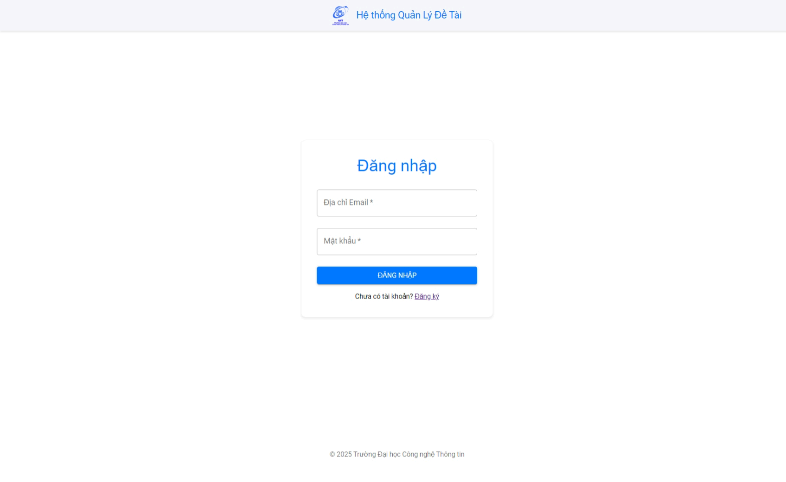
   
<i>Màn hình đăng nhập</i>

   
   * Chỉ có Admin mới có thể tạo tài khoản mới và cấp cho giảng viên và sinh viên (theo bussiness rule). 
   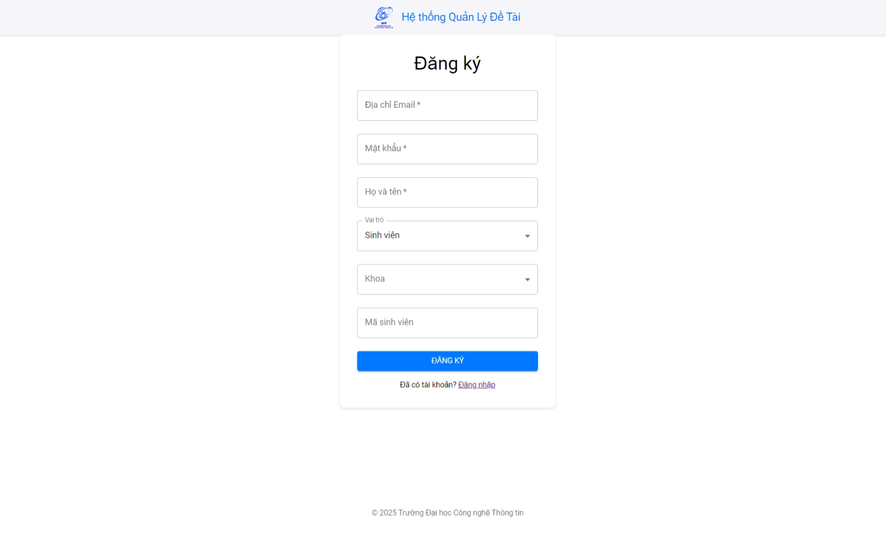
   
<i>Màn hình đăng ký</i>

   
2. Màn hình danh sách lớp
   * Màn hình này hiển thị danh sách các lớp học, hiển thị tất cả lớp học cho người dùng  admin,chỉ hiển thị các lớp học có sự tham gia của giảng viên hoặc sinh viên
     
   
   
<i>Giao diện danh sách các lớp</i>

   
3. Màn hình danh sách đề tài của lớp học
   * Màn hình này hiển thị danh sách các đề tài hiện có trong lớp học đó cùng trạng thái của đề tài 
   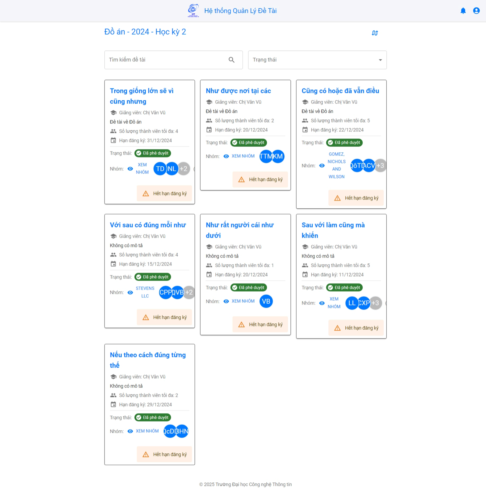
   
<i>Giao diện danh sách đề tài</i>

   
4. Màn hình thông tin đề tài
   * Màn hình này hiển thị thông tin của đề tài được chọn
   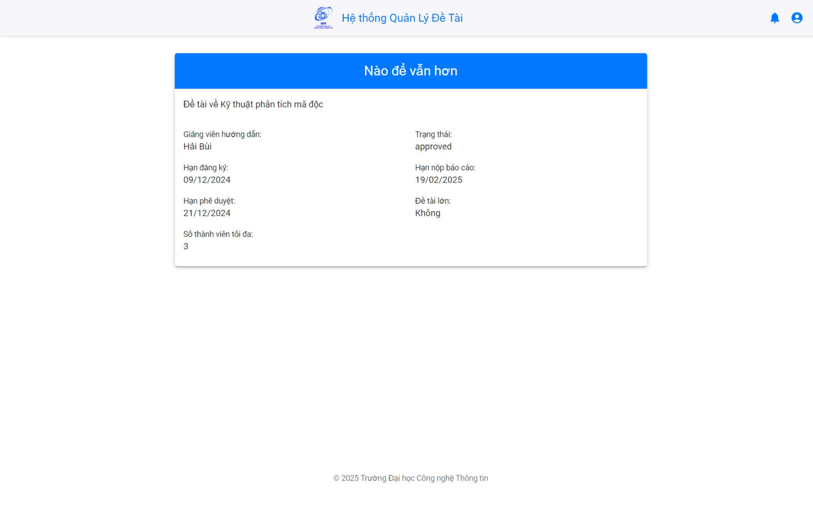
   
<i>Giao diện thông tin đề tài</i>

   
5. Màn hình thêm và quản lý nhóm
   * Tạo nhóm mới và quản lý thành viên nhóm.
   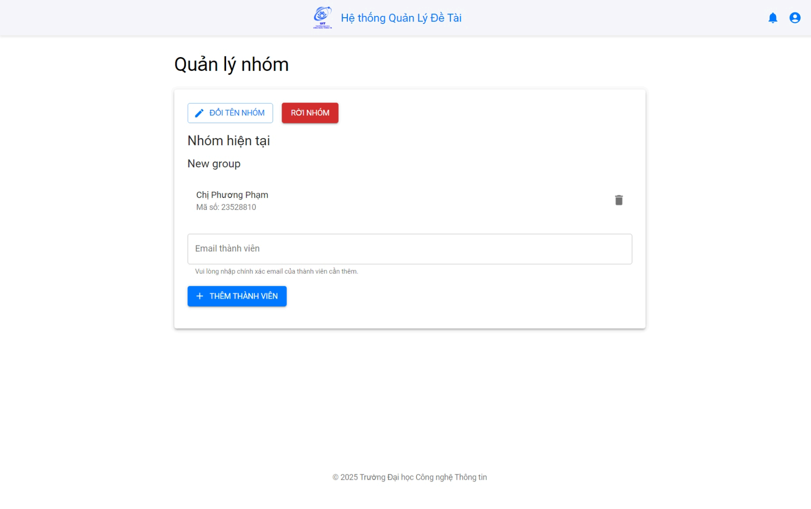
   
<i>Giao diện thêm và quản lý nhóm</i>

   * Thông tin nhóm.
   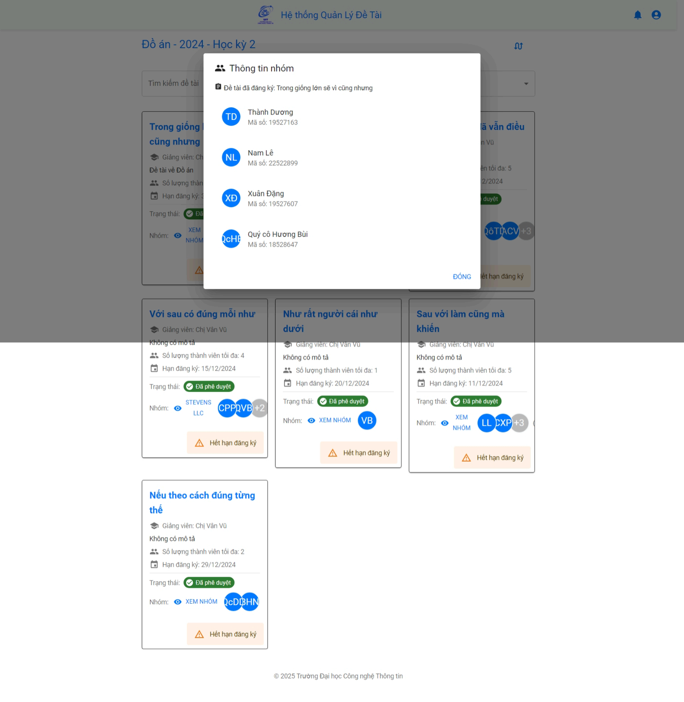
   
<i>Giao diện xem thông tin nhóm</i>

   
6. Màn hình danh sách đề tài phê duyệt
   * Phê duyệt các đề tài
   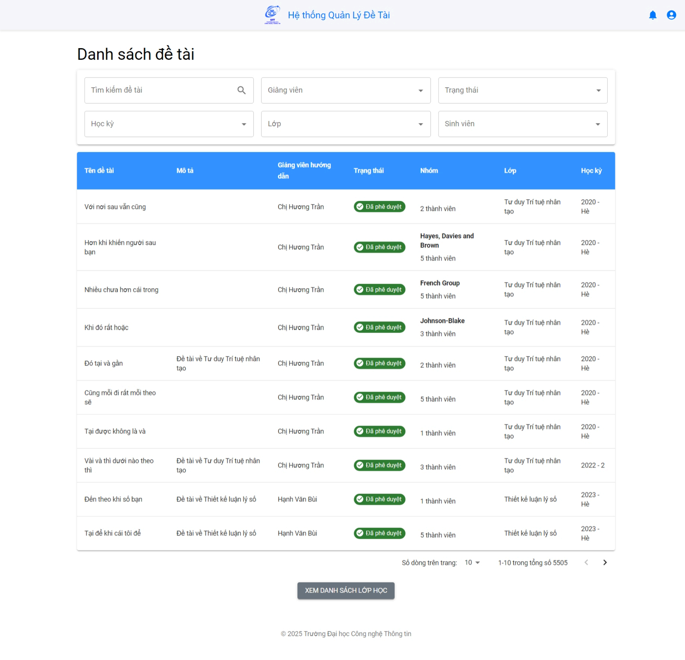
   
<i>Giao diện phê duyệt đề tài</i>

   
7. Màn hình tài khoản
   * Quản lý tài khoản cá nhân, xem thông tin, danh sách các lớp tham gia, chỉnh sửa thông tin tài khoản
   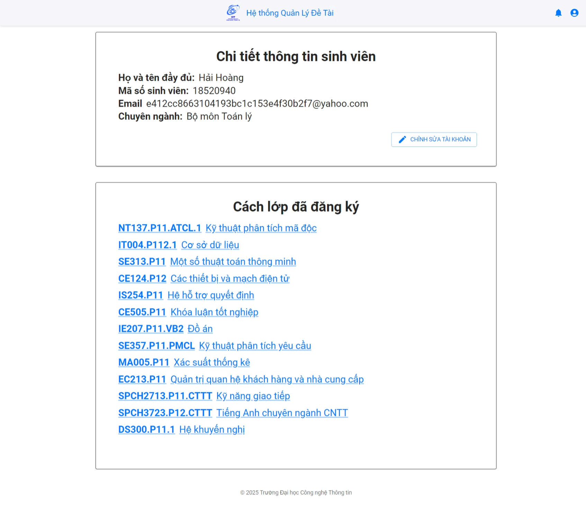
   
<i>Giao diện quản lý tài khoản</i>

   
   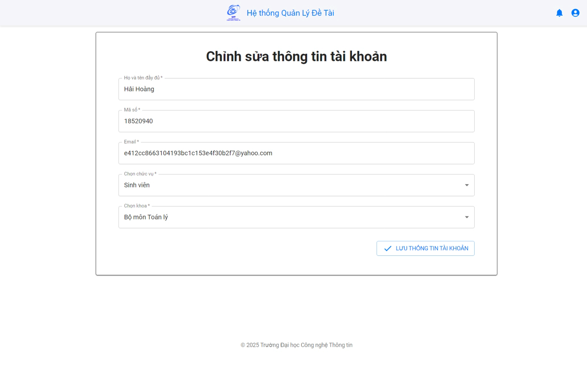
   
<i>Giao diện quản lý tài khoản</i>

     
8. Các màn hình quản lý
   * Quản lý danh sách tài khoản của các admin, giảng viên, sinh viên trong hệ thống
   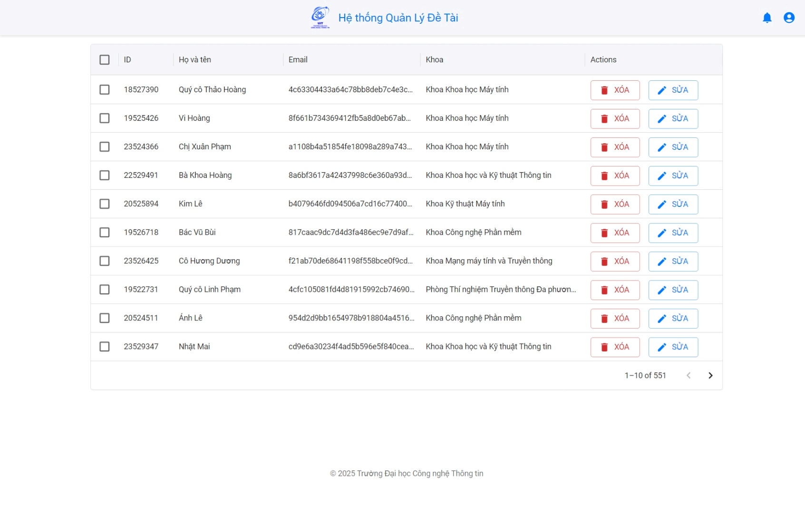
   
<i>Giao diện quản lý danh sách tài khoản</i>

   * Quản lý danh sách lớp có trong hệ thống
   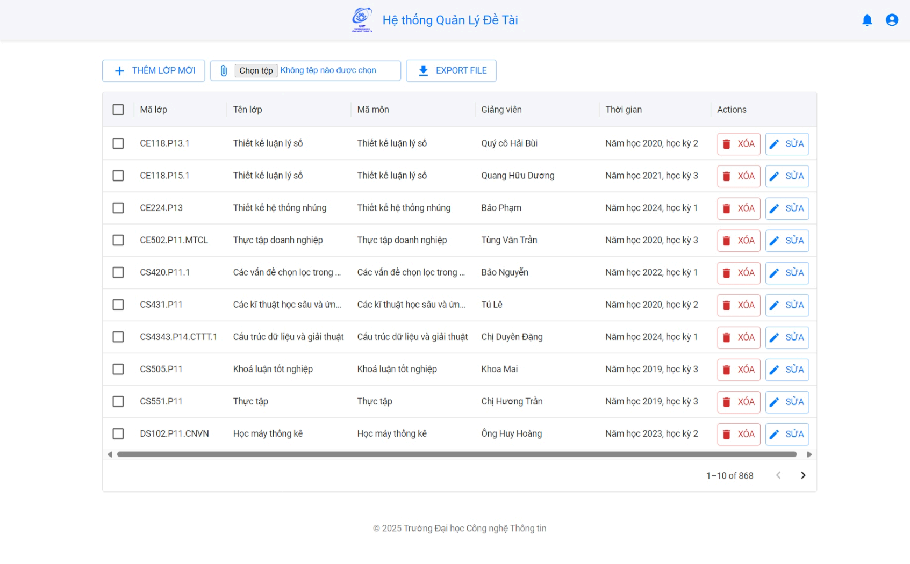
   
<i>Giao diện quản lý danh sách lớp</i>

(<a href="#readme-top">back to top</a>)

<!-- CONTACT -->
## Liên hệ

* Nguyễn Quốc Thái Dương - [Facebook](https://www.facebook.com/profile.php?id=100010982231797) - 21520758@gm.uit.edu.vn
* Phạm Bá Hoàng - [Facebook](https://www.facebook.com/kv7r2) - 21520872@gm.uit.edu.vn

Project Link: [course-project-management](https://github.com/Sunny020303/course-project-management)

(<a href="#readme-top">back to top</a>)

<!-- ACKNOWLEDGMENTS -->
## Nguồn tài liệu tham khảo

Đây là những nguồn tài liệu nhóm chúng mình đã sử dụng để có thể thực hiện được đồ án này!

* [Node.js](https://nodejs.org/en)
* [React](https://react.dev/)
* [MUI: The React component library](https://mui.com/)
* [Supabase | The Open Source Firebase Alternative](https://supabase.com/)
* [React Tutorial by W3School](https://www.w3schools.com/react/default.asp)
* [JavaScript Tutorial by W3School](https://www.w3schools.com/js/default.asp)

(<a href="#readme-top">back to top</a>)

